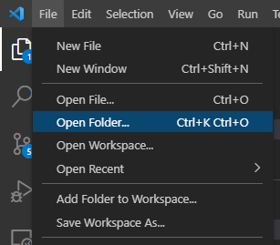

# Visual Studio Code
> It is helpful to have the VS Code Explorer page open to see the directory heirarchy. This can be opened from "View > Explorer" or using "Ctrl+Shift+E"

## Clone Repository
1. Open VS Code
2. Open Terminal (Terminal > New Terminal)\
   
3. Navigate to where you want your TermProject (i.e. `cd "C:\Users\${USER}\Documents\School\ML\TermProject"`)\
   
4. Execute: `git clone https://github.com/kperont/KazooKart.git`
   * This wil create a new directory called `KazooKart` inside your current directory\
   
5. Open the newly cloned git folder (File > Open Folder > KazooKart)\
   

## Create New Branch
1. From the VS Code terminal opened above, execute `git branch` to view your current branch
2. To create a new branch, execute: `git checkout -b your_branch_name`
   * To checkout an existing branch, execute: `git checkout existing_branch`
   * It is standard to name branches `feature/feature_name`
3. Once you have a new branch created, you may start editing that branch!
   * If you accidentally started editing the `master` branch, you can execute: `git stash`, and then checkout your working branch (new or existing).

## Pushing Your Branch to Github
From the VS Code terminal, ensure your directory is in the git folder (KazooKart). Execute the following commands **in this order**:
1. `git add *` : (Adds all current files to local branch)
2. `git commit -m "your commit message"` : (Commits your local changes to local branch)
3. `git push https://github.com/kperont/KazooKart.git your_branch_name` : (Pushes local branch to remote branch on Github)

> **NOTE: DO NOT COMMIT TO MASTER**. Master will be updated from a Merge Request on Github (likely from the `develop` branch that I will be making)